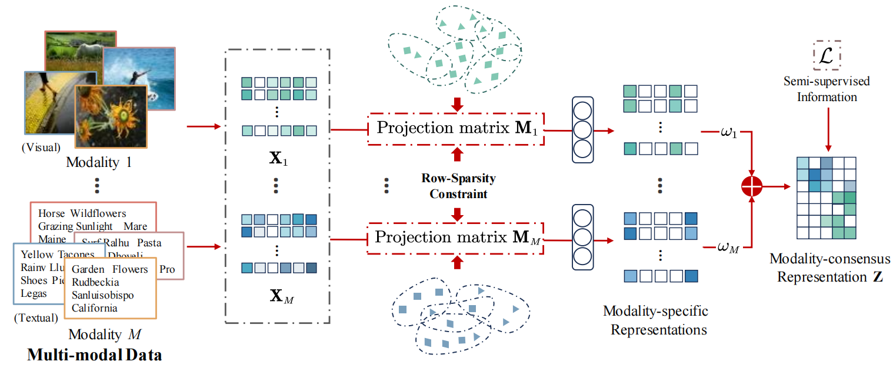

<h2 align="center"> <a href="https://link.springer.com/article/10.1007/s10462-025-11224-8">Scalable Multi-modal Representation Learning Networks</a></h2>

<div align="center">

**Zihan Fang<sup>1,2</sup>, Ying Zou<sup>1,2</sup>, Shiyang Lan<sup>1,2</sup>, Shide Du<sup>1,2</sup>, Yanchao Tan<sup>1,2</sup>, Shiping Wang<sup>1,2</sup>**

<sup>1</sup>College of Computer and Data Science, Fuzhou University, Fuzhou 350108, China<br>
<sup>2</sup>Key Laboratory of Intelligent Metro, Fujian Province University, Fuzhou 350108, China<br>
</div>

## Abstract
Multi-modal representation learning is recognized for its comprehensive interpretation across diverse modalities. Although existing approaches have yielded favorable results, they face challenges in high-order information preservation and out-of-sample data generalization. To tackle these issues, we propose a scalable multi-modal representation learning networks framework, which aims to learn optimal modality-specific projection matrices to project multi-modal features to a shared representation space. Specifically, weight guided modality-wise and row-sparsity driven feature-wise measures are considered to achieve adaptively hierarchical feature selection from the original data. Then, within the unified latent representation space, we employ hypergraph embedding to preserve the intricate high-order local geometric structures within the modality-specific high-dimensional spaces. Finally, we propose a proximal operator-inspired network architecture to resolve the optimization objectives, streamlining the process of feature auto-weighted selection and representation learning. The experimental results highlight the effectiveness and superiority of the proposed method, while online testing on out-of-sample data further demonstrates robust generalization.

## Model Architecture
<div align="center">
  
</div>

## Experiment


### Data
We conducted experiments on six publicly available multi-view datasets [link](https://drive.google.com/drive/folders/1Jh4IHkpoLcFe6slS_-jXZ7uFqYIaNJ-1):

| Datasets   | # Samples | # Feature dimensions            | # Classes |
|------------|-----------|----------------------------------|-----------|
| BDGP       | 2500      | 79 / 1750                        | 5         |
| ESP-Game   | 11,032    | 100 / 100                        | 7         |
| Flickr     | 12,154    | 100 / 100                        | 7         |
| HW         | 2000      | 153 / 596 / 301 / 481 / 157 / 27 | 10        |
| NUS-WIDE   | 20,000    | 100 / 100                        | 8         |
| Reuters    | 1500      | 21,531 / 24,892 / 34,251 / 15,506 / 11,547 | 6 |


### Running the Code

To run the model, use the following commands:

```bash
python inductive_test.py
```

## Reference

If you find our work useful in your research, please consider citing:

```latex
@article{fang2025scalable,
  title={Scalable multi-modal representation learning networks},
  author={Fang, Zihan and Zou, Ying and Lan, Shiyang and Du, Shide and Tan, Yanchao and Wang, Shiping},
  journal={Artificial Intelligence Review},
  volume={58},
  number={7},
  pages={209},
  year={2025},
}
```
